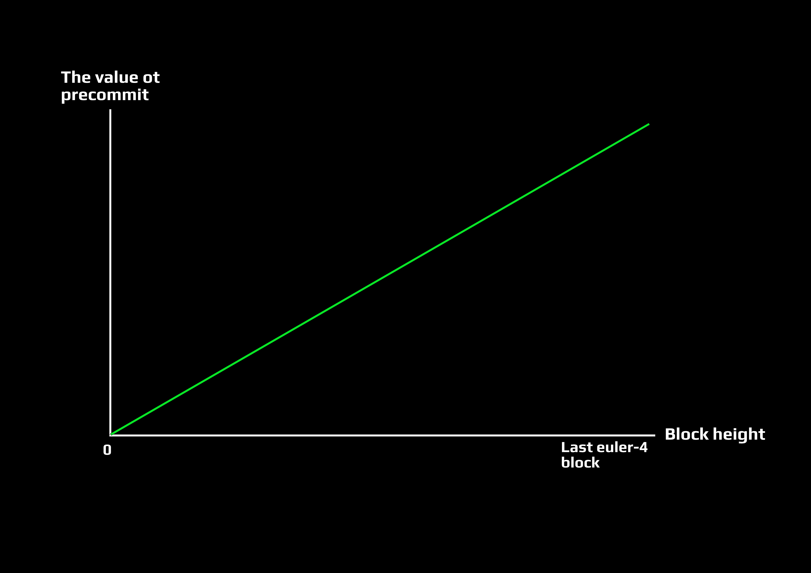
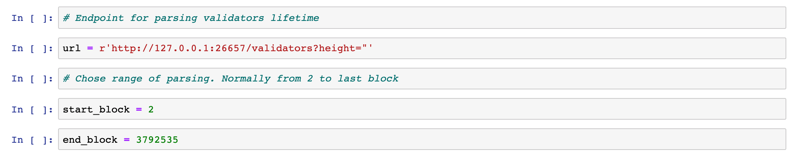

# Mainnet rewards calculating tool for early validators

Early validators have supported and stimulated euler-4 testnet. It deserves to reward and our great thanks. The main idea of rewarding was migrating balances between testnets. Unfortunately, there was no consensus about validators faucet tokens quantity. Also, we've faced on with [withdrawing rewards bug](https://github.com/cybercongress/cyberd/issues/302), so our validators lose so many tokens between migrating.

The question is how to distribute mainnet supply percent between validators fairly?

## Rewarding for lifetime

Invaluable validators help is network support. And every block this help became more valuable. We decide to assess validators work as linearity of block height and participating value.



<p align = "center">The part of reward per each validator if precommit was</p>

This way we can calculate shares between validators by their precommits with weight depends on block height.

## DIY

**You need nodeJS, python3, pip3 and jupyter installed. Synced cyberd node strongly recommended**

0. Clone repo

```bash
git clone https://github.com/SaveTheAles/val-lifetime-distr
```

1. Run `jupyter`:

```bash
jupyter notebook
```
It should open at `localhost:8888`

2. Find in `jupyter` ui project repo and open `parser.ipynb`

Type `Shift + Enter` or `Run` button to execute parts of code. 

> Probably you need to install some libraries. The best way to do that is `pip3 install <library_name>`

3. Set node `url`. Normally to get data from localhost. But if you have just remote connection it's OK. Long but OK.
Also, set start block and end block for parser.  



4. With alocal connection, getting data should be 1.5 - 2 hours. Another way it depends on your connection. Normally 8-20 hours. It should return you large `.csv` file with blocks and validators participated in that blocks.

5. Go to `balances.ipynb` and exec it step-by-step. You should get a beautiful plot of all validators lifetime and `balance.json` file with CYB balance calculation per each validator in mainnet. 

6. Go to cyberd rpc endpoint `/staking/vlidators` and save that json as `validators_list.json`. 

7. Run:

```bash
node ./index.js
```

It should return json file with validators in bech32 and balances in CYB